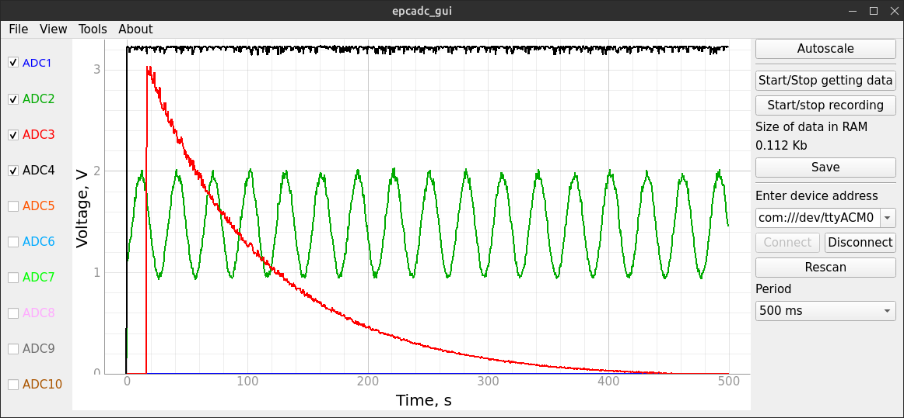

# usbadc10
Графический интерфейс для устройства usbadc10.
Помимо неё здесь также приложены тесты и тест скорости, по которому оценивалась скорость работы 

Запустить этот проект (из корня):
## Linux
```bash
sudo -H pip3 install -r requirements.txt
python3 -m urpcadcgui.urgui
```
## Windows
```bash
pip install -r requirements.txt
python -m urpcadcgui.urgui
```
## Установка Linux
```bash
source release.sh
```
## Установка Windows
```bash
source release-win.bat
```

